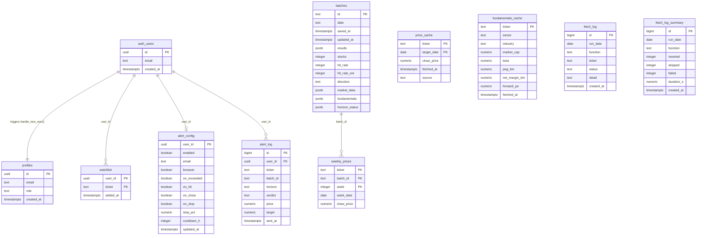
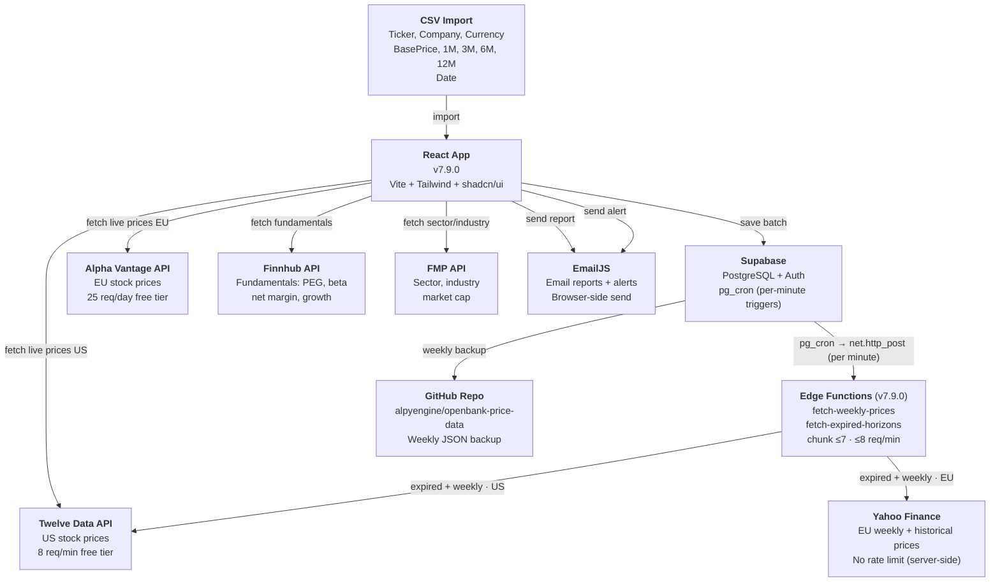
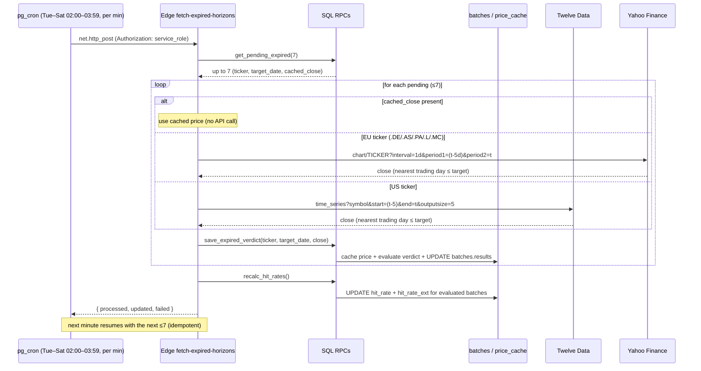
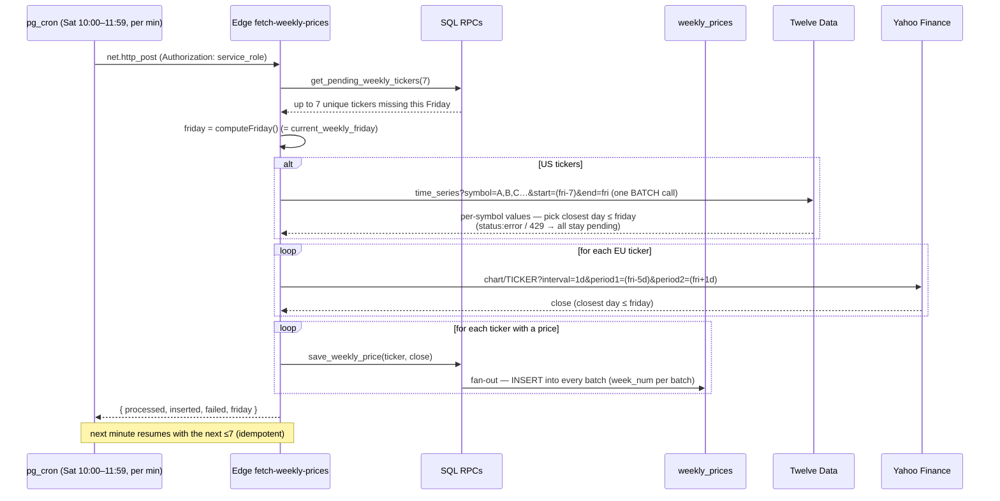
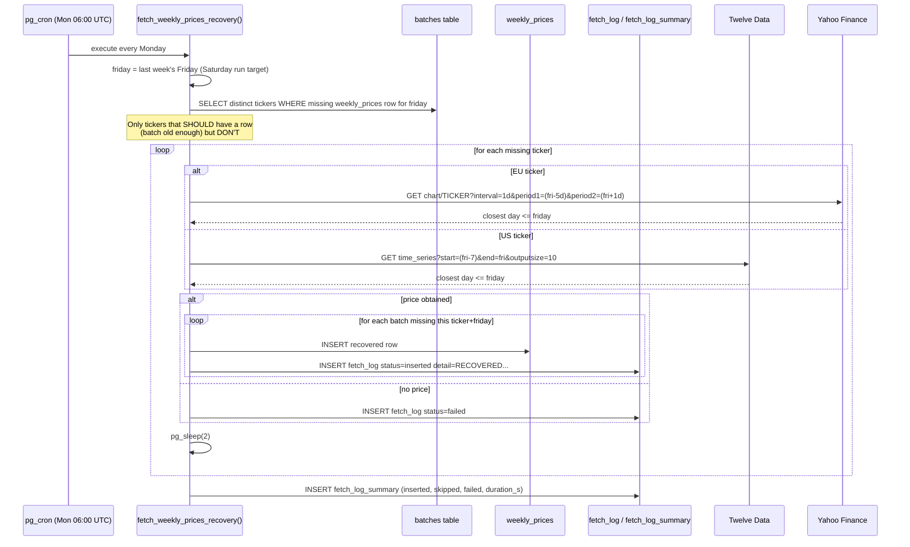
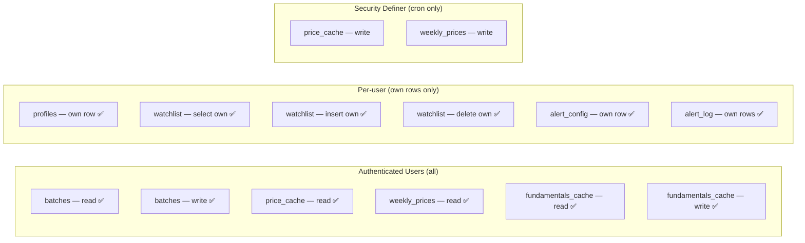
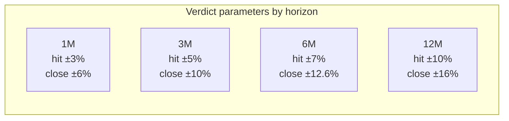

# Openbank Price Prediction — Supabase UML Diagram

Complete entity-relationship and system architecture diagram for the Supabase backend.

---

## Entity Relationship Diagram

---

## System Architecture — Data Flow

---

## Cron Job Schedule

```mermaid
gantt
    title Supabase cron jobs — weekly schedule (UTC) · v7.9.0
    dateFormat HH:mm
    axisFormat %H:%M

    section Tue–Sat
    fetch-expired-horizons-edge (job 12, per min) :crit, 02:00, 120m

    section Saturday
    fetch-weekly-prices-edge (job 10, per min)    :active, 10:00, 120m

    section Sunday
    backup_to_github (job 6)                      :done, 23:00, 30m

    section Monday
    fetch_weekly_prices_recovery (job 8)          :crit, 06:00, 30m
```

> Jobs 10 & 12 fire **every minute** inside their window and trigger the Edge
> Function via `net.http_post`; each call handles a chunk of ≤7 and returns in
> seconds. The old SQL jobs 1 (`fetch_expired_horizons`) and 2 (`fetch_weekly_prices`)
> are **paused** since v7.9.0 (kept as fallback).

---

## Function Call Flow — fetch-expired-horizons (Edge Function · v7.9.0)

---

## Function Call Flow — fetch-weekly-prices (Edge Function · v7.9.0)

## Function Call Flow — fetch_weekly_prices_recovery()

> Still a **SQL** function (job 8, active). Kept as a Monday safety net. With the
> v7.9.0 weekly Edge Function self-resuming across the Saturday window it's largely
> redundant, but it stays as a cheap fallback.

---

## Row Level Security — Access Matrix

---

## Verdict Evaluation Logic

---

## Hit Margin Parameters by Horizon

---

*Generated from `docs/supabase_setup.sql` + `supabase/` (Edge Functions & RPCs) · v7.9.0 · June 2026*
