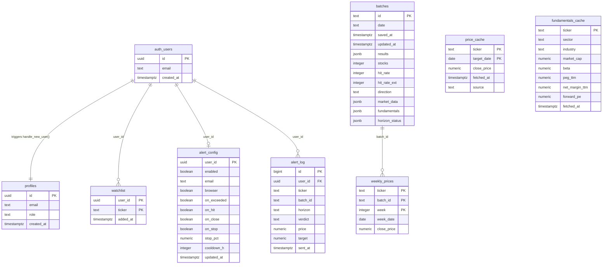
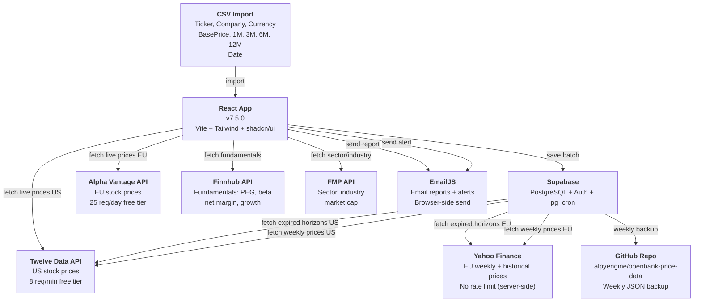
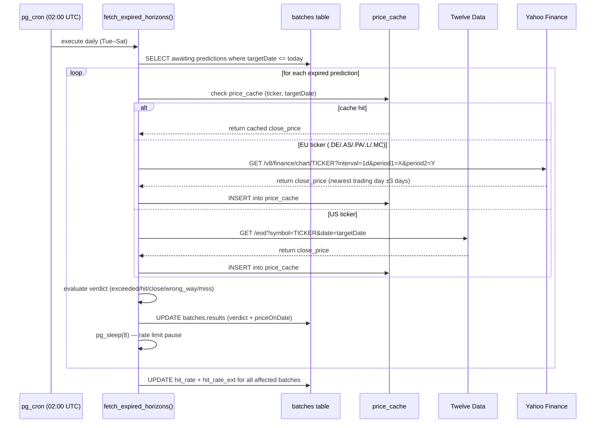
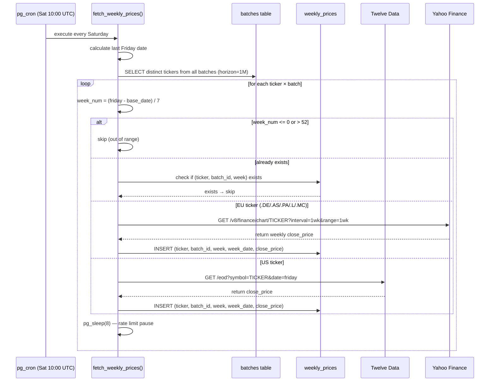
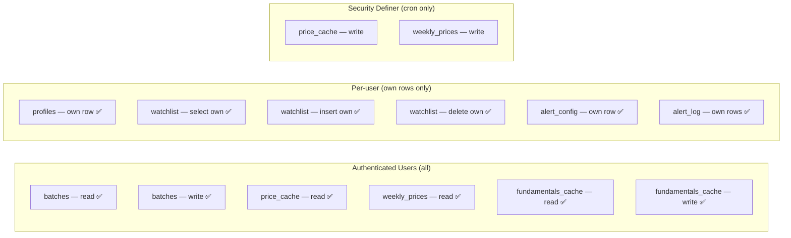
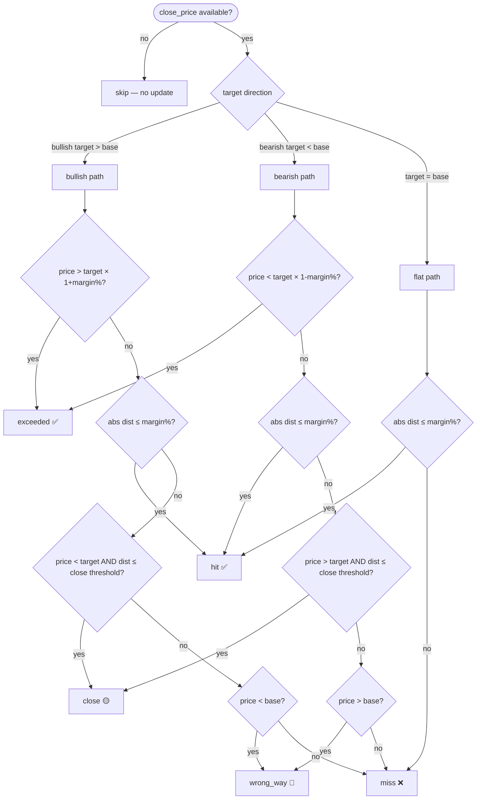
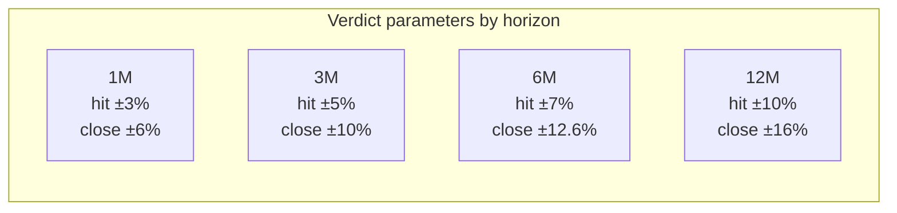

# Openbank Price Prediction — Supabase UML Diagram

Complete entity-relationship and system architecture diagram for the Supabase backend.

---

## Entity Relationship Diagram

---

## System Architecture — Data Flow

---

## Cron Job Schedule

```mermaid
gantt
    title Supabase cron jobs — weekly schedule (UTC)
    dateFormat HH:mm
    axisFormat %H:%M

    section Tuesday–Saturday
    fetch_expired_horizons() :crit, 02:00, 30m

    section Saturday
    fetch_weekly_prices()    :active, 10:00, 60m

    section Sunday
    backup_to_github()       :done, 23:00, 30m
```

---

## Function Call Flow — fetch_expired_horizons()

---

## Function Call Flow — fetch_weekly_prices()

---

## Row Level Security — Access Matrix

---

## Verdict Evaluation Logic

---

## Hit Margin Parameters by Horizon

---

*Generated from `docs/supabase_setup.sql` · v7.5.0 · June 2026*
